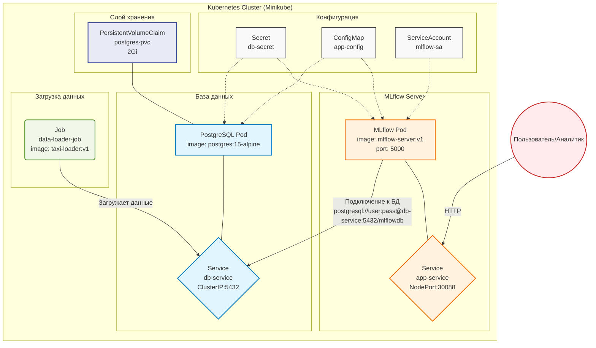

# Лабораторная работа №3. Развертывание аналитического сервиса в кластере Kubernetes. Вариант 22

**Вариант:** 22
**Необходимые сервисы** - MLflow, PostgreSQL.	Развернуть MLflow Server (Tracking server) с бэкендом в Postgres для хранения метрик моделей.
---

## 1. Цель работы
Получить практические навыки оркестрации контейнеризированных приложений в среде Kubernetes. Выполнить миграцию архитектуры из Docker Compose в K8s, настроить управление конфигурациями (ConfigMaps/Secrets), обеспечить персистентность данных (PVC), настроить проверки жизнеспособности (Probes) и привязать кастомный ServiceAccount.

## 2. Технический стек и окружение
- **ОС:** Ubuntu 24.04 LTS
- **Контейнеризация:** Docker 24.x
- **Оркестрация:** Minikube (Driver: Docker), Kubernetes (kubectl)
- **База данных:** PostgreSQL 15 (Alpine)
- **Язык программирования:** Python 3.10
- **Аналитическая среда:** MLflow

## 3. Архитектура решения

