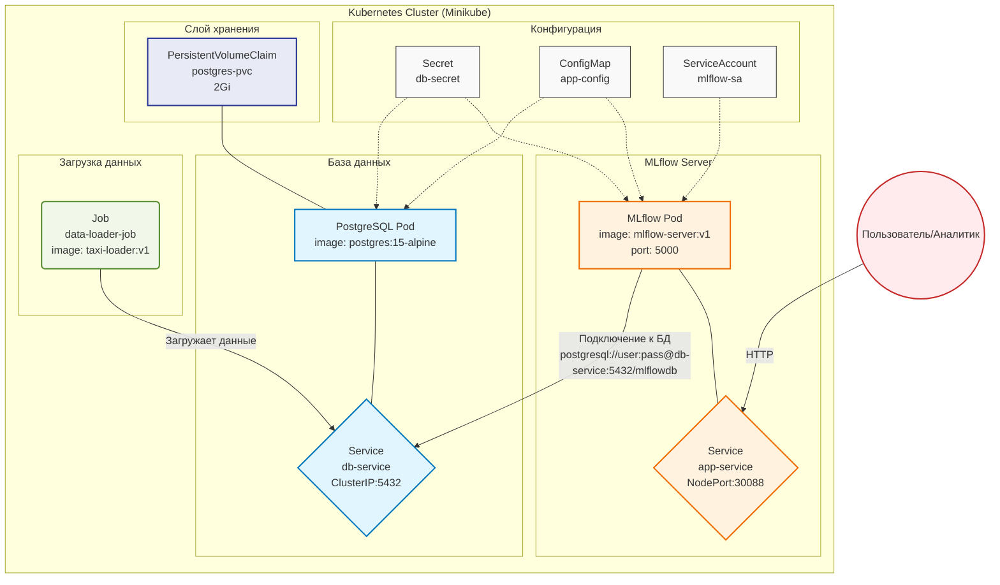

# Лабораторная работа №3. Развертывание аналитического сервиса в кластере Kubernetes. Вариант 22


**Необходимые сервисы** - MLflow, PostgreSQL.	Развернуть MLflow Server (Tracking server) с бэкендом в Postgres для хранения метрик моделей.

Папка проекта:
- [lw_03](https://github.com/SvetlanaSel/CI_CD/blob/main/lw_03/lw_03%20(1).zip)
---

## 1. Цель работы
Получить практические навыки оркестрации контейнеризированных приложений в среде Kubernetes. Выполнить миграцию архитектуры из Docker Compose в K8s, настроить управление конфигурациями (ConfigMaps/Secrets), обеспечить персистентность данных (PVC), настроить проверки жизнеспособности (Probes) и привязать кастомный ServiceAccount.

## 2. Технический стек и окружение
- **ОС:** Ubuntu 24.04 LTS
- **Контейнеризация:** Docker 24.x
- **Оркестрация:** Minikube (Driver: Docker), Kubernetes (kubectl)
- **База данных:** PostgreSQL 15 (Alpine)
- **Язык программирования:** Python 3.10
- **Аналитическая среда:** MLflow

## 3. Архитектура решения


---

## 4. Исходный код Docker-образов (Локальная сборка)

Dockerfile для образа MLflow:
```
FROM python:3.11-slim

RUN pip install --no-cache-dir \
    mlflow==2.12.1 \
    psycopg2-binary==2.9.9

EXPOSE 5000

CMD sh -c "mlflow server \
    --backend-store-uri postgresql://${POSTGRES_USER}:${POSTGRES_PASSWORD}@${DB_HOST}:${DB_PORT}/${POSTGRES_DB} \
    --default-artifact-root /mlruns \
    --host 0.0.0.0 \
    --port 5000"
```
Dockerfile для загрузки данных (Loader):

```
FROM python:3.10-slim
RUN pip install psycopg2-binary
COPY loader.py /app/loader.py
CMD ["python", "/app/loader.py"]
```
loader.py:

```
import psycopg2
import os
import random
import time

print("Waiting for DB to be fully ready...")
time.sleep(5)

conn = psycopg2.connect(
    host=os.getenv("DB_HOST"),
    port=os.getenv("DB_PORT", "5432"),
    dbname=os.getenv("POSTGRES_DB"),
    user=os.getenv("POSTGRES_USER"),
    password=os.getenv("POSTGRES_PASSWORD")
)

cur = conn.cursor()

cur.execute("""
    CREATE TABLE IF NOT EXISTS simple_house_prices (
        id          SERIAL PRIMARY KEY,
        size_m2     INTEGER,          -- площадь дома в м²
        rooms       INTEGER,          -- количество комнат
        age_years   INTEGER,          -- возраст дома
        price       INTEGER           -- цена в тысячах (примерно)
    );
""")

print("Добавляем данные о домах...")

data = [
    (80,  3, 15,  4500),
    (120, 4, 5,   7200),
    (65,  2, 25,  3200),
    (150, 5, 2,   9800),
    (90,  3, 10,  5100),
    (200, 6, 8,  11500),
    (55,  1, 30,  2800),
    (110, 4, 3,   6800),
    (75,  3, 18,  4100),
    (140, 5, 7,   8900),
]

for base_size, base_rooms, base_age, base_price in data * 50:  
    size = base_size + random.randint(-15, 15)
    rooms = base_rooms + random.randint(-1, 1)
    age = base_age + random.randint(-5, 10)
    price = base_price + random.randint(-800, 1200)

    size = max(40, min(250, size))
    rooms = max(1, min(7, rooms))
    age = max(0, min(50, age))
    price = max(2000, min(15000, price))

    cur.execute(
        "INSERT INTO simple_house_prices (size_m2, rooms, age_years, price) VALUES (%s, %s, %s, %s)",
        (size, rooms, age, price)
    )

conn.commit()
print("Данные о ценах на дома загружены!")
cur.close()
conn.close()
```

## 5. Манифесты Kubernetes

01 secret:

```
apiVersion: v1
kind: Secret
metadata:
  name: db-secret
type: Opaque
data:
  POSTGRES_USER: YWRtaW4=
  POSTGRES_PASSWORD: YWRtaW4=
---
apiVersion: v1
kind: ConfigMap
metadata:
  name: app-config
data:
  POSTGRES_DB: "mlflowdb"
  DB_HOST: "db-service"
  DB_PORT: "5432"
---
apiVersion: v1
kind: PersistentVolumeClaim
metadata:
  name: postgres-pvc
spec:
  accessModes:
    - ReadWriteOnce
  resources:
    requests:
      storage: 2Gi
---
apiVersion: v1
kind: ServiceAccount
metadata:
  name: mlflow-sa
  labels:
    app: mlflow-app
```
02 pvc:
```
apiVersion: v1
kind: PersistentVolumeClaim
metadata:
  name: postgres-pvc
spec:
  accessModes:
    - ReadWriteOnce
  resources:
    requests:
      storage: 1Gi
```
03 service account:
```
apiVersion: v1
kind: ServiceAccount
metadata:
  name: mlflow-sa
  labels:
    app: taxi-app
```
04 db:
```
apiVersion: apps/v1
kind: Deployment
metadata:
  name: db-deployment
spec:
  replicas: 1
  selector:
    matchLabels:
      app: postgres
  template:
    metadata:
      labels:
        app: postgres
    spec:
      containers:
      - name: postgres
        image: postgres:15-alpine
        env:
        - name: POSTGRES_USER
          valueFrom:
            secretKeyRef:
              name: db-secret
              key: POSTGRES_USER
        - name: POSTGRES_PASSWORD
          valueFrom:
            secretKeyRef:
              name: db-secret
              key: POSTGRES_PASSWORD
        - name: POSTGRES_DB
          valueFrom:
            configMapKeyRef:
              name: app-config
              key: POSTGRES_DB
        volumeMounts:
        - mountPath: /var/lib/postgresql/data
          name: db-data
      volumes:
      - name: db-data
        persistentVolumeClaim:
          claimName: postgres-pvc
---
apiVersion: v1
kind: Service
metadata:
  name: db-service
spec:
  type: ClusterIP
  selector:
    app: postgres
  ports:
  - port: 5432
    targetPort: 5432
```
05 app:
```
apiVersion: apps/v1
kind: Deployment
metadata:
  name: app-deployment
spec:
  replicas: 1
  selector:
    matchLabels:
      app: mlflow
  template:
    metadata:
      labels:
        app: mlflow
    spec:
      serviceAccountName: mlflow-sa
      initContainers:
      - name: wait-for-db
        image: busybox:1.35
        command:
        - sh
        - -c
        - until nc -z db-service 5432; do echo waiting for db; sleep 2; done;
      containers:
      - name: mlflow
        image: mlflow-server:v1
        imagePullPolicy: Never
        ports:
        - containerPort: 5000
        envFrom:
        - configMapRef:
            name: app-config
        - secretRef:
            name: db-secret
        readinessProbe:
          httpGet:
            path: /
            port: 5000
          initialDelaySeconds: 30
          periodSeconds: 10
          failureThreshold: 6
        livenessProbe:
          httpGet:
            path: /
            port: 5000
          initialDelaySeconds: 60
          periodSeconds: 30
---
apiVersion: v1
kind: Service
metadata:
  name: app-service
spec:
  type: NodePort
  selector:
    app: mlflow
  ports:
  - port: 5000
    targetPort: 5000
    nodePort: 30088
```
06 job:
```
apiVersion: batch/v1
kind: Job
metadata:
  name: data-loader-job
spec:
  template:
    spec:
      containers:
      - name: loader
        image: taxi-loader:v1
        imagePullPolicy: Never
        envFrom:
        - configMapRef:
            name: app-config
        - secretRef:
            name: db-secret
      restartPolicy: OnFailure
```
---

## 6. Тестирование
Содержание файла для тестов test_connection:

```
import psycopg2
import mlflow
import time

print("ПРОВЕРКА СВЯЗИ МЕЖДУ СЕРВИСАМИ")

print("\n1. Проверка подключения к PostgreSQL...")
try:
    conn = psycopg2.connect(
        host="localhost",
        port=5433,
        dbname="mlflowdb",
        user="admin",
        password="admin"
    )
    cur = conn.cursor()
    
    cur.execute("SELECT COUNT(*) FROM simple_house_prices")
    count = cur.fetchone()[0]
    print(f"   Подключение к PostgreSQL успешно")
    print(f"   Записей в таблице simple_house_prices: {count}")
    
    cur.execute("SELECT size_m2, rooms, age_years, price FROM simple_house_prices LIMIT 3")
    print(f"   Примеры данных:")
    for row in cur.fetchall():
        print(f"      площадь: {row[0]}м2, комнат: {row[1]}, возраст: {row[2]} лет, цена: {row[3]} тыс.")
    
    cur.close()
    conn.close()
    
except Exception as e:
    print(f"   Ошибка подключения к PostgreSQL: {e}")
    print("   Убедитесь, что запущен порт-форвардинг: kubectl port-forward deployment/db-deployment 5432:5432")

print("\n2. Проверка подключения к MLflow Server...")
try:
    mlflow.set_tracking_uri("http://localhost:5000")
    
    print(f"   Версия MLflow: {mlflow.__version__}")
    
    experiment_name = "integration_test"
    try:
        experiment_id = mlflow.create_experiment(experiment_name)
        print(f"   Создан новый эксперимент: {experiment_name}")
    except:
        experiment = mlflow.get_experiment_by_name(experiment_name)
        experiment_id = experiment.experiment_id
        print(f"   Используется существующий эксперимент: {experiment_name}")
    
    with mlflow.start_run(experiment_id=experiment_id, run_name="connection_test"):
        mlflow.log_param("test_time", time.strftime("%Y-%m-%d %H:%M:%S"))
        mlflow.log_param("postgres_records", count)
        mlflow.log_metric("connection_success", 1)
        mlflow.log_metric("records_count", count)
        mlflow.log_param("sample_house_size", 80)
        mlflow.log_param("sample_house_price", 4500)
        
        print(f"   Run создан: connection_test")
        print(f"   Метрики и параметры залогированы")
    
    print(f"\nОткройте MLflow UI: http://localhost:5000")
    print(f"   Найдите эксперимент '{experiment_name}' и run 'connection_test'")
    
except Exception as e:
    print(f"   Ошибка подключения к MLflow: {e}")
    print("   Убедитесь, что запущен порт-форвардинг: kubectl port-forward deployment/app-deployment 5000:5000")

print("ПРОВЕРКА ЗАВЕРШЕНА")

```
## 7. Запуск проекта

Запуск: minikube start --driver=docker


Сборка:
```
eval $(minikube docker-env)
docker build -t taxi-loader:v1 ./loader
docker build -t mlflow-server:v1 ./app
```


Развертывание: kubectl apply -f k8s/


Проверка доступности: minikube service app-service (откроет браузер).


Проверка взаимосвязи


Запуск теста:
1. Переброс портов


2. Запуск тестового файла


3. Открыть mlflow в браузере. Можно увидеть, что тестовая работа появилась на странице mlflow


---
## Вывод

В результате работы были успешно запущены 2 сервиса, между которыми реализовано взаимодействие, была развернута платформа в Minikube для отслеживания экспериментов MLflow с бэкендом PostgreSQL, обеспечивающая надежное хранение метрик моделей и загрузку тестовых данных.
